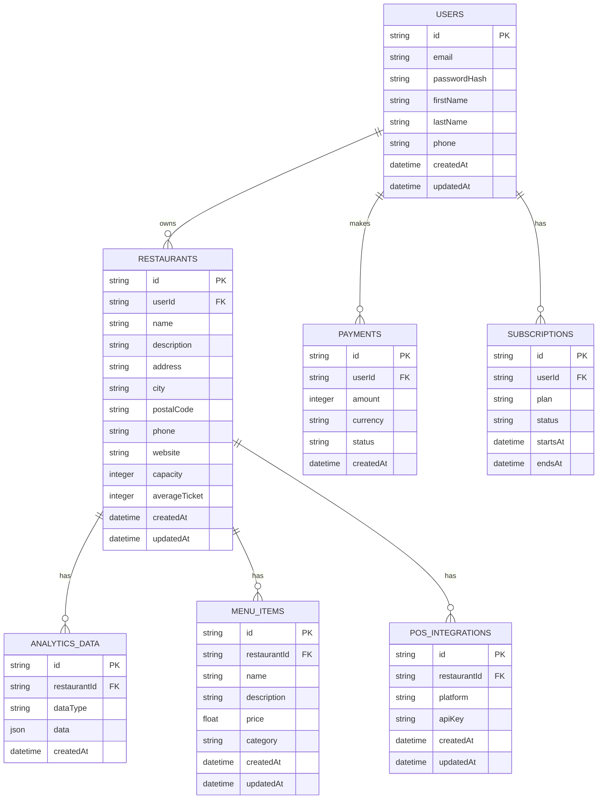

# Production Migration: Architectural Plan

This document outlines the architectural plan and step-by-step roadmap for transitioning the BiteBase AI SaaS web application from a prototype with mock data to a production-ready system.

## 1. Mock Data and Placeholder Analysis

The following files have been identified as containing mock data, placeholder content, or non-production implementations that must be replaced:

### Backend
- `apps/backend/ADVANCED_AI_INTELLIGENCE.md`
- `apps/backend/index-backup.js`
- `apps/backend/index.js`
- `apps/backend/mcp-server.js`
- `apps/backend/server-no-db.js`
- `apps/backend/ENHANCED_LOCATION_FEATURES.md`
- `apps/backend/FINAL_INTEGRATION_SUCCESS.md`
- `apps/backend/INTELLIGENCE_ENHANCEMENT_SUMMARY.md`
- `apps/backend/INTEGRATION_SUCCESS_SUMMARY.md`

### Frontend
- `apps/frontend/components/ai/EnhancedBiteBaseAI.tsx`
- `apps/frontend/app/franchise/page.tsx`
- `apps/frontend/app/admin/page.tsx`
- `apps/frontend/components/dashboard/BusinessIntelligenceHub.tsx`
- `apps/frontend/components/checkout/CheckoutForm.tsx`
- `apps/frontend/components/ai/FloatingChatbot.tsx`
- `apps/frontend/components/changelog/ModernChangelog.tsx`
- `apps/frontend/app/admin/seo/page.tsx`
- `apps/frontend/app/product/kitchen-operations/page.tsx`
- `apps/frontend/app/product/menu-engineering/page.tsx`
- `apps/frontend/app/product/kitchen-operations-simple/page.tsx`
- `apps/frontend/components/landing/BetaInspiredLandingPage.tsx`
- `apps/frontend/components/restaurant/RestaurantExplorer.tsx`
- `apps/frontend/app/restaurant-setup/page.tsx`
- `apps/frontend/app/settings/page.tsx`
- `apps/frontend/components/pos/ExternalDataSourceConfig.tsx`
- `apps/frontend/app/settings/profile/page.tsx`
- `apps/frontend/components/layout/header.tsx.bak`
- `apps/frontend/components/layout/MainLayout.tsx`
- `apps/frontend/components/ui/data-table.tsx`
- `apps/frontend/components/dashboard/README.md`

## 2. Database Schema

A PostgreSQL database is recommended. The following schema defines the core entities of the application.

## 3. API Design

The existing mock API will be replaced with a production-ready RESTful API. All endpoints will be secured with JWT-based authentication.

### Authentication
- `POST /api/auth/register`: Register a new user.
- `POST /api/auth/login`: Log in and receive a JWT.
- `GET /api/auth/me`: Get the current user's profile.

### Restaurants
- `GET /api/restaurants`: Get all restaurants for the current user.
- `POST /api/restaurants`: Create a new restaurant.
- `GET /api/restaurants/:id`: Get a specific restaurant.
- `PUT /api/restaurants/:id`: Update a restaurant.
- `DELETE /api/restaurants/:id`: Delete a restaurant.

### Analytics
- `GET /api/restaurants/:id/analytics`: Get analytics data for a restaurant.
- `POST /api/restaurants/:id/analytics`: Add new analytics data.

### Payments & Subscriptions
- `POST /api/payments/create-intent`: Create a new payment intent with Stripe.
- `GET /api/subscriptions`: Get the current user's subscription.
- `POST /api/subscriptions`: Create a new subscription.

## 4. Authentication and Authorization

- **Authentication**: JWTs will be issued upon login and validated on all protected routes.
- **Authorization**: Role-based access control will be implemented to restrict access to certain endpoints (e.g., admin routes).

## 5. External API Integrations

- **Foursquare**: The Foursquare API will be used for all location-based data, including restaurant search, details, and geospatial analysis.
- **Stripe**: Stripe will be integrated for payment processing and subscription management in a later phase.

## 6. Configuration and Secrets Management

- **Environments**: The application will support `development`, `staging`, and `production` environments.
- **Configuration**: Environment variables will be managed with `.env` files.
- **Secrets**: Sensitive data (API keys, database credentials) will be stored in a secure vault like HashiCorp Vault or AWS Secrets Manager.

## 7. Testing Strategy

- **Unit Tests**: Jest and React Testing Library will be used for testing individual components and functions.
- **Integration Tests**: Tests will be written to verify interactions between different parts of the application (e.g., frontend and backend).
- **End-to-End Tests**: Cypress will be used to simulate user workflows and test the application from the user's perspective.

## 8. Migration Roadmap

The migration will be executed in the following phases:

1.  **Phase 1: Database and API Implementation**
    - Set up the PostgreSQL database.
    - Implement the database schema.
    - Develop the real API endpoints with authentication.
2.  **Phase 2: Foursquare API Integration**
    - Integrate the Foursquare API for all location-based features.
    - Replace all mock location data with real data from the Foursquare API.
3.  **Phase 3: Frontend Integration**
    - Replace all mock API calls with the real API.
    - Implement user authentication flows.
    - Connect all components to the real data.
4.  **Phase 4: Stripe Integration (Future)**
    - Integrate Stripe for payment processing and subscription management.
5.  **Phase 5: Testing and Deployment**
    - Write unit, integration, and end-to-end tests.
    - Set up CI/CD pipelines for automated testing and deployment.
    - Deploy the application to a staging environment for final testing.
    - Deploy to production.